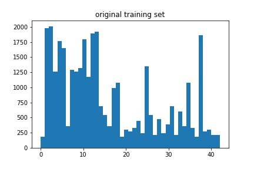
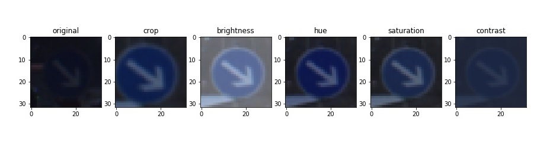
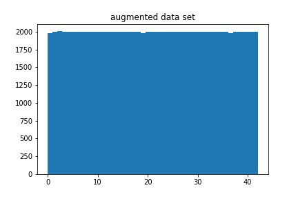
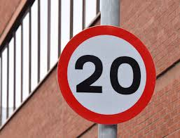
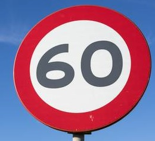
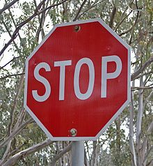
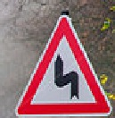
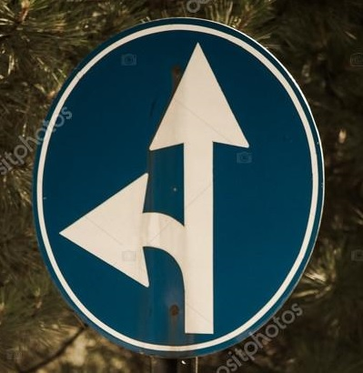
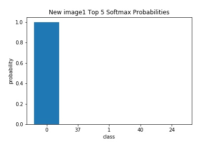
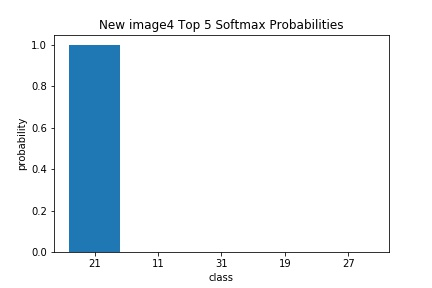

# **Traffic Sign Recognition** 

## Writeup

---

**Build a Traffic Sign Recognition Project**

The goals / steps of this project are the following:
* Load the data set (see below for links to the project data set)
* Explore, summarize and visualize the data set
* Design, train and test a model architecture
* Use the model to make predictions on new images
* Analyze the softmax probabilities of the new images
* Summarize the results with a written report

## Rubric Points
### Here I will consider the [rubric points](https://review.udacity.com/#!/rubrics/481/view) individually and describe how I addressed each point in my implementation.  

---
### Writeup / README

#### 1. Provide a Writeup / README that includes all the rubric points and how you addressed each one. You can submit your writeup as markdown or pdf. You can use this template as a guide for writing the report. The submission includes the project code.

You're reading it! and here is a link to my [project code](https://github.com/hankkkwu/SDCND-P3-Traffic_sign_classifier/blob/master/Traffic_Sign_Classifier.ipynb)

### Data Set Summary & Exploration

#### 1. Provide a basic summary of the data set. In the code, the analysis should be done using python, numpy and/or pandas methods rather than hardcoding results manually.

I used the python library to calculate summary statistics of the traffic signs data set:

* The size of training set is 34799
* The size of the validation set is 4410
* The size of test set is 12630
* The shape of a traffic sign image is (32x32x3)
* The number of unique classes/labels in the data set is 43

#### 2. Include an exploratory visualization of the dataset.

Here is an exploratory visualization of the data set. The x-axis is classes, and y-axis is number of examples in each class.

### Design and Test a Model Architecture

#### 1. Describe how you preprocessed the image data. What techniques were chosen and why did you choose these techniques? Consider including images showing the output of each preprocessing technique. Pre-processing refers to techniques such as converting to grayscale, normalization, etc. (OPTIONAL: As described in the "Stand Out Suggestions" part of the rubric, if you generated additional data for training, describe why you decided to generate additional data, how you generated the data, and provide example images of the additional data. Then describe the characteristics of the augmented training set like number of images in the set, number of images for each class, etc.)

I decided to generate additional data because my original model was overfitting the training set and the number of examples in each class are imbalance.

To add more data to the the data set, I used the color shifting and random cropping techniques because using the color shifting I can effeciently create 4 different images (changing the brightness, hue, saturation and contrast individually) and do not change orientation of the images. I also use the random cropping technique to let traffic sign can appear everywhere in a image.

Here is an example of an original image and an augmented image:

The difference between the original data set and the augmented data set is the following:

As a last step, I normalized the image data because this way the value of image will have similar scale between [0,1], and will speed up my training.

#### 2. Describe what your final model architecture looks like including model type, layers, layer sizes, connectivity, etc.) Consider including a diagram and/or table describing the final model.

My final model consisted of the following layers:

| Layer         		|     Description	        					| 
|:---------------------:|:---------------------------------------------:| 
| Input         		| 32x32x3 RGB image   							| 
| Convolution 5x5     	| 1x1 stride, valid padding, outputs 28x28x12 	|
| RELU					|												|
| Max pooling	      	| 2x2 stride,  outputs 14x14x12 				|
| Convolution 5x5	    | 1x1 stride, valid padding, outputs 10x10x24   |
| RELU					|												|
| Max pooling	      	| 2x2 stride,  outputs 5x5x24    				|
| Fully connected1		| outputs 180           						|
| Fully connected2		| outputs 96   									|
| Softmax				| outputs 43   									| 

#### 3. Describe how you trained your model. The discussion can include the type of optimizer, the batch size, number of epochs and any hyperparameters such as learning rate.

To train the model, I used an Adam optimizer, and choose the batch size to be 32, set learning rate to 0.0006, then trained the model for 40 epoches. To prevent overfitting, I apply L2 regulariztion(set hyperparameter=0.007) and dropout(set keep_prob=0.5 for Fully connected1 and keep_prob2=0.7 for Fully connected2).

#### 4. Describe the approach taken for finding a solution and getting the validation set accuracy to be at least 0.93. Include in the discussion the results on the training, validation and test sets and where in the code these were calculated. Your approach may have been an iterative process, in which case, outline the steps you took to get to the final solution and why you chose those steps. Perhaps your solution involved an already well known implementation or architecture. In this case, discuss why you think the architecture is suitable for the current problem.

My final model results were:
* training set accuracy of 0.971
* validation set accuracy of 0.977
* test set accuracy of 0.966

The first architecture I choose was LeNet, because it is good at recognizing digit numbers, and some of traffic signs have number on it. I thought it might work fine on classifying traffic signs.
  
When I train it, I found the LeNet was not good enough for the traffic sign classification. I think that is because LeNet was designed for recognizing grayscale images, but the traffic signs are RGB images, therefore I tried to increase the number of filters in conv1 (from 6 to 16) and conv2 (from 16 to 24), so it can get more features from the input images, since the number of filters in conv1 and conv2 are increasing, I tried to adjust the output nurons in fully-connected layers as well. 

I also found out that the original model was overfitting my training set, so I decided to do data augmentation(code in `data_augmentation()` function) and add L2 regularization(code in `compute_loss()` function) and dropout(code in `Traffic_dign_classifier()` function).
  
Next, I tuned the batch size to 32, I also tried to adjust it to 16, 64, and 128, but 32 performed better for my model. I also played around with the learning rate, and found that learning rate cannot be larger than 0.001 for this model.

Finally, I got my training accuracy to 97.1%, validation set accuracy to 97.7% (code in 15th cell). In the experiment, I found that dropout randomly knocks out units in my network really improved the performance of my model significantly, after adding dropout to the 2 fully-connected layer, it increase the accuracy of validation set around 2-3%. When every thing was done, I ran my model on the test set(code in 16th cell) and got 96.6% accuracy.
 

### Test a Model on New Images

#### 1. Choose five German traffic signs found on the web and provide them in the report. For each image, discuss what quality or qualities might be difficult to classify.

Here are five German traffic signs that I found on the web:

   
 

The second image might be difficult to classify because it seems my model doesn't do well on recognizing the numbers.

#### 2. Discuss the model's predictions on these new traffic signs and compare the results to predicting on the test set. At a minimum, discuss what the predictions were, the accuracy on these new predictions, and compare the accuracy to the accuracy on the test set (OPTIONAL: Discuss the results in more detail as described in the "Stand Out Suggestions" part of the rubric).

Here are the results of the prediction:

| Image			        |     Prediction	        					| 
|:---------------------:|:---------------------------------------------:| 
| Speed limit (20km/h)  | Speed limit (20km/h)							| 
| Speed limit (60km/h)	| Go straight or left 							|
| Stop					| Stop											|
| Double curve     		| Double curve					 				|
| Go straight or left   | Go straight or left 							|

The model was able to correctly guess 4 of the 5 traffic signs, which gives an accuracy of 80%. But test set has an accuracy of 96.6%, I think I need more data(by using more image preprocessing techniques or from real world) to improve the accuracy in the real world.

#### 3. Describe how certain the model is when predicting on each of the five new images by looking at the softmax probabilities for each prediction. Provide the top 5 softmax probabilities for each image along with the sign type of each probability. (OPTIONAL: as described in the "Stand Out Suggestions" part of the rubric, visualizations can also be provided such as bar charts)

For the first image, the model is relatively sure that this is a Speed limit (20km/h) sign (probability of 0.99), and the image does contain a Speed limit (20km/h) sign. The top five soft max probabilities were:

For the second image, the model is relatively sure that this is a Go straight or left sign (probability of 0.99), but the image contains a Speed limit (60km/h) sign. The top five soft max probabilities were:

 

For the third image, the model is relatively sure that this is a Stop sign (probability of 0.99), and the image does contain a Stop sign. The top five soft max probabilities were:

 

For the forth image, the model is relatively sure that this is a Double curve sign (probability of 0.99), and the image does contain a Double curve sign. The top five soft max probabilities were:

For the fifth image, the model is relatively sure that this is a Go straight or left sign (probability of 1.0), and the image does contain a Go straight or left sign. The top five soft max probabilities were:

### (Optional) Visualizing the Neural Network (See Step 4 of the Ipython notebook for more details)
#### 1. Discuss the visual output of your trained network's feature maps. What characteristics did the neural network use to make classifications?

From the conv1's feature maps, I think it tried to learn about the shapes or edges of the image:

For the conv2, I think it learnt something not human readable features:

